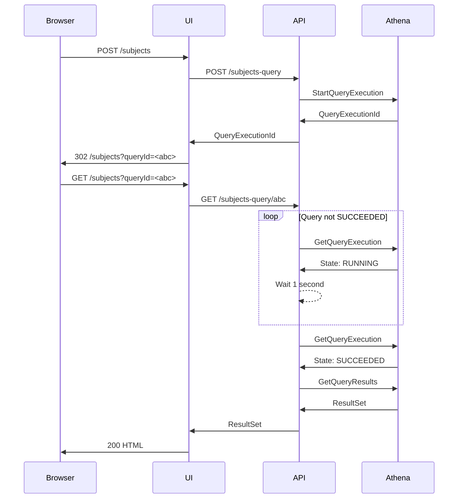

# Athena Query Process Flow

The diagram below describes how a user's request for data initiates a query process that involves several components: a web browser, the User Interface (UI), the API layer, and Athena. 

## Participants
- Browser: The user's web browser (e.g., Chrome) that interacts with the web application.

- UI: The User Interface application, server-side rendered (SSR), nodejs app.

- API: The API, which acts as a gateway between the UI and Athena. It handles business logic and data access.

- Athena: AWS Athena, run queries on Electronic Monitoring datasets in the Data Store. These queries can take time to complete.

## Query Process Flow
The process can be broken down into three main phases:

### Query Initiation
- The user submits a form to the UI.

- The UI forwards the request to the API.

- The API generates the SQL for the Athena query and starts the query execution in Athena. Athena immediately returns a QueryExecutionId (a unique ID for the running query) to the API.

- The API sends this QueryExecutionId back to the UI.

- UI sends a redirect to the Browser. The UI doesn't wait for the query to finish. Instead, it sends a 302 Found redirect response to the browser. This redirect points the browser to a new URL: /subjects?queryId=abc, where abc is the QueryExecutionId.

### Polling for Query Completion
- Browser follows redirect: The browser automatically follows the 302 redirect and makes a GET /subjects?queryId=abc request to the UI.

- UI requests the query result from the API.

- The API polls the Athena status:
  - If it receives a status that is not SUCCEEDED, it waits 1 second and tries again.

- Athena reports the query has SUCCEEDED.

### Fetching and Displaying Results
- API retrieves results from Athena.

- API sends results to the UI

- UI renders into an HTML containing the results

- UI sends HTML to the Browser, which then displays the completed data to the user.
